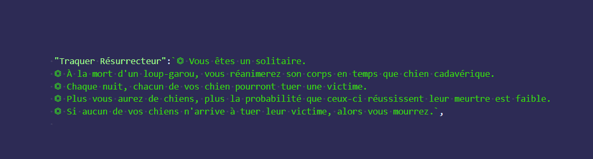
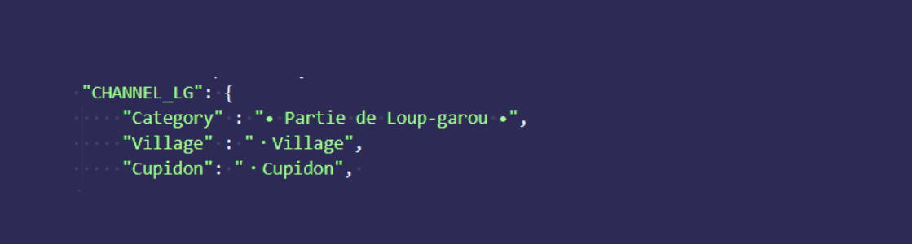
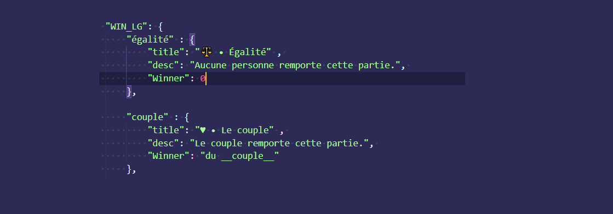
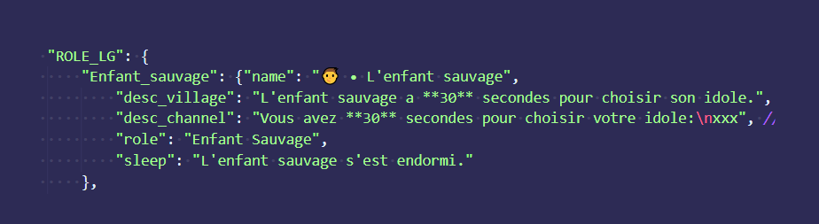

# Kani custom lang
Create your own custom lang for the Discord Bot Kanishiel

To create your own lang, 

 - Fork this repository
 
 - Modify (this will be explained later how)
 
 - Create a pull request

That's easy as this !

> How to modify with your translation ? 

First of all, 
You will have to copy the example into translation, rename "example" folder with the name of your translation with the patern "lang-theme" and start creating your custom lang :

 - role_description.js

*For helping you, we put the role number so you can refere to the `k-lgrole <nb>` command on KaniShiel if you change the name and don't remember the original role.*

The first part of the role is his name ( ⚠️ You are obliged to provide one, if you want to remove the role of the language, just fill the description with "disable")

After this, we have the description. That can be split in multiple part (here 5) :

First part is the role camp (here Solo), second and after are the power(s) (here there is 4 line to describes the power)

**Disclaimer:** You can't create power, you can just change the descritpion of a power but it will leave it with the classic werewolf game power

PLEASE KEEP THE TEMPLATE, DONT USE SOME FANTASY AND ALSO DONT MOOVE THE ROLE ORDER

 - description_game.js
 
*more and more complexer*

Fist : channels

The werewolf channels are made in two part : the key, that you have to **never** change and the name, that you're free to change to everything

Second : Win

In four parts : key (never change), title, description and which camp win

Third : Game

In six parts : key, top of message, description in the village channel, description in his private channel, role name, message when ha go asleep